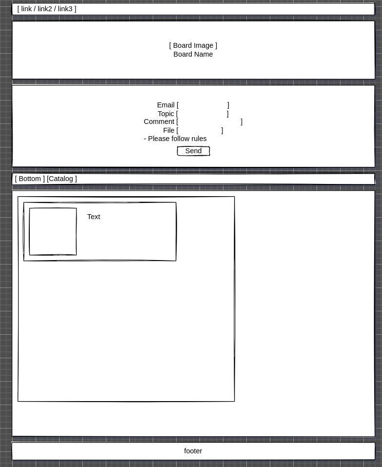

# Parky Boards
Simple thread/image board project focused on simplicity and functionality.

- Mongo
- Express
- Angular
- Node



## Setting up
Work in progress

## Server endpoints
#### Start thread [Auth]
`POST /thread`
```json
{
    "title": "Hello",
    "content": "World"
}
```

#### Fetch 10 threads
`GET /thread`

#### Find a thread
`GET /thread/<thread_id>`

#### Send comment [Auth]
`POST /comment`
```json
{
	"content": "LOOOOOOL", 
	"thread": "62619a32e86f2f8619bb414f"
}
```

#### Fetch comments
`POST /comment`
```json
[
    "62619a32e86f2f8619bb414f",
    "abcd",
    ...
]
```

#### Register
`POST /register`
```json
{
	"user": "someone",
	"pass": "123"
}
````

#### Login
`POST /login`
```json
{
	"user": "someone",
	"pass": "123"
}
````
